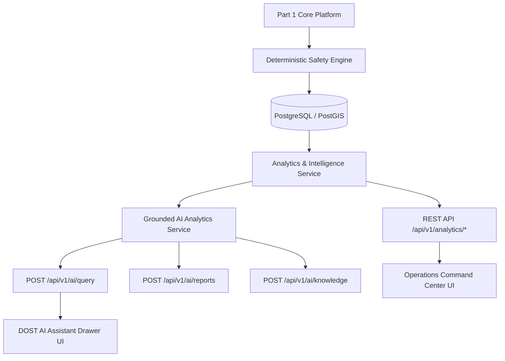

# DOST Guardian 2.0 — Part 2 Architecture Specification
## Operations Command Center, Safety Intelligence & Grounded AI Platform

### 1. Architectural Overview

Part 2 builds upon the existing Application Foundation, Geospatial Platform, and Part 1 Real-Time Safety Engine to provide high-density command center visibility, safety intelligence analytics, and grounded AI operational query capabilities.

---

### 2. Strict Safety Principles & AI Guardrails

1. **Non-Authoritative AI**: The AI model functions exclusively as an assistive query, summarization, and reporting interface.
2. **Deterministic Governance**: The deterministic `SafetyEngine` remains 100% authoritative for safety states (`SAFE`, `CAUTION`, `WARNING`, `CRITICAL`, `EMERGENCY`). AI cannot override, suppress, or modify safety decisions.
3. **Data Grounding**: All natural language query answers are synthesized directly from validated empirical database queries (`AnalyticsService`) and standard operating procedures.
4. **RBAC Enforcement**: AI tool invocations enforce user roles (`WORKER`, `SUPERVISOR`, `CONTROL_ROOM`, `ADMIN`, `AUDITOR`). Unauthorized data access requests are rejected.

---

### 3. Key Services & Components

| Module | Location | Purpose |
|---|---|---|
| `AnalyticsService` | `backend/app/services/analytics_service.py` | Calculates live KPIs, event timelines, safety metrics, heatmaps, work zone & team profiles. |
| `AIService` | `backend/app/services/ai_service.py` | Grounded NL query processing, markdown report generation, SOP documentation search. |
| `Analytics API` | `backend/app/api/v1/analytics.py` | Exposes `/api/v1/analytics/kpis`, `/timeline`, `/safety-metrics`, `/heatmap`. |
| `AI Analytics API` | `backend/app/api/v1/ai_analytics.py` | Exposes `/api/v1/ai/query`, `/reports`, `/knowledge`. |
| `AIAssistantDrawer` | `src/components/ai/AIAssistantDrawer.tsx` | Command-center floating drawer UI for NL querying, report export, and SOP search. |
| `CommandCenterView` | `src/components/views/CommandCenterView.tsx` | Unified operational dashboard with filters, live map, alerts, and timeline drawer. |

---

### 4. Verification Results

- **Backend Pytest Suite**: 30/30 passed in 1.02s (`backend/tests/test_analytics.py`, `test_safety_engine.py`, `test_geospatial.py`).
- **Frontend Typecheck**: `npx tsc --noEmit` passed with 0 errors.
- **Production Build**: `npm run build` succeeded in 2.76s (`dist/assets/index-UJx-hYxL.js`).
- **Docker Environment**: PostgreSQL 16 + PostGIS 3.4 (`dost_postgres`), Redis 7 (`dost_redis`), and FastAPI (`dost_backend`) verified healthy.
