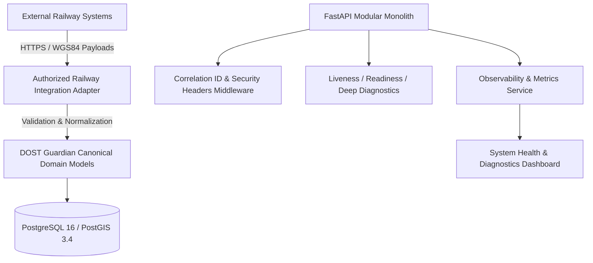

# DOST Guardian 2.0 — Part 3 Architecture Specification
## Production Readiness, Observability & Authorized Railway Integration Architecture

### 1. Architectural Overview

Part 3 establishes the production readiness, observability, health diagnostics, security hardening, and external integration adapter layer for the DOST Guardian 2.0 platform.

---

### 2. Integration Adapter Architecture

The platform provides a secure normalization boundary for external railway telemetry.

| Endpoint | Ingest Target | Normalization & Validation Policy |
|---|---|---|
| `POST /api/v1/integration/train-positions` | `TrainPositionIngest` | Converts external coordinates to WGS84 `POINT(lng lat)`. Telemetry > 60s old flagged `DEGRADED`. |
| `POST /api/v1/integration/block-status` | `BlockStatusIngest` | Normalizes block section operational status and speed limits. |
| `POST /api/v1/integration/work-orders` | `WorkOrderIngest` | Normalizes work zone boundaries and safety buffer distances. |
| `POST /api/v1/integration/emergencies` | `EmergencyIngest` | Ingests external track emergency signals with audit tracking. |
| `GET /api/v1/integration/contracts` | Integration Schema Docs | Self-documenting schema contracts and versioning rules. |
| `POST /api/v1/integration/simulate-tick` | Simulated Provider Tick | Simulated external railway control center tick for non-live integration testing. |

---

### 3. Security & Observability Features

1. **Correlation Tracing**: Every request is assigned or preserves `X-Correlation-ID` and `X-Request-ID` headers for end-to-end event traceability.
2. **Security Headers**: Injects `X-Content-Type-Options: nosniff`, `X-Frame-Options: DENY`, and `X-XSS-Protection: 1; mode=block`.
3. **Secrets Management**: Source code sanitized of hard-coded credentials; default settings configured via `.env` / environment variables.
4. **Health Diagnostics**: Probe endpoints at `/api/v1/health/live`, `/api/v1/health/ready`, and `/api/v1/health/deep`.

---

### 4. Final Verification Summary

- **Backend Pytest Suite**: 40/40 passed in 1.63s (`backend/tests/test_production_readiness.py`, `test_integration_adapter.py`, `test_analytics.py`, `test_safety_engine.py`, `test_geospatial.py`).
- **Frontend Typecheck**: `npx tsc --noEmit` passed with 0 errors.
- **Production Build**: `npm run build` succeeded in 2.67s (`dist/assets/index-CdcrrWxr.js`).
- **Docker Compose**: `docker-compose.yml` configured with health checks (`pg_isready`, `redis-cli ping`, `health/live`) and `unless-stopped` restart policy.
